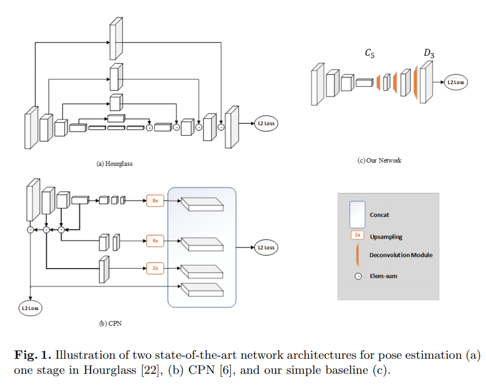

# Human Pose Estimation and ONNX Models

## Assignment

1. You are implementing ["Simple Baseline for HPE and tracking"](https://github.com/Microsoft/human-pose-estimation.pytorch). [Read the paper](https://arxiv.org/pdf/1804.06208.pdf) and write a detailed readme file describing the model architecture as well as the JointsMSELoss class. - 1000 pts
2. Download the smallest [model](https://onedrive.live.com/?authkey=%21AFkTgCsr3CT9%2D%5FA&id=56B9F9C97F261712%2110709&cid=56B9F9C97F261712) and upload to Lambda for HPE detection - 1000 pts
3. Make sure to draw the points on the image, as well as connect the joints in the right fashion. - 1000 pts

## Solution

### Link: [https://thetensorclan-web.herokuapp.com/](https://thetensorclan-web.herokuapp.com/)

### Demo


> ### **Medium Blog Explaining the assignment: [https://medium.com/@satyajitghana7/human-pose-estimation-and-quantization-of-pytorch-to-onnx-models-a-detailed-guide-b9c91ddc0d9f](https://medium.com/@satyajitghana7/human-pose-estimation-and-quantization-of-pytorch-to-onnx-models-a-detailed-guide-b9c91ddc0d9f)**

---

## Analysis of the Paper "Simple Baselines for Human Pose Estimation and Tracking"

> The paper emphasises on creating a simple model for hpe by asking the question "how good could a simple method be?"

The model proposed is a simple deconvolutional network added to a ResNet backbone network. This model gives the state-of-the-art mAP of `73.7` on COCO test-dev split.

It is a bottom-up approach, since we are going to predict the probability of joints and then connect them to create the human pose.



Here we can see Hourglass approach which follows a multi-stage arch. with repeated bottom-up, top-down approach.

and CPN (Cascaded Pyramid Network) is is similar to how YOLO does, it created feature maps at different resolutions.

and the model in the paper is `(c)` which had C5(ResNet) and D3(DeConvNet)

Three deconvolutional layers with batch norm and ReLU act. are used. Each layer had 256 filters with `4x4` kernels with stride of 2 (weird noe ? since we generally prefer to use `3x3` with stride on 1 and then do max pool)

The following is a torn down version of the network to understand its implementation

```python
class PoseResNet(nn.Module):

    def __init__(self, block, layers, cfg, **kwargs):
        self.inplanes = 64
        super(PoseResNet, self).__init__()
        self.conv1 = nn.Conv2d(3, 64, kernel_size=7, stride=2, padding=3,
                               bias=False)
        self.bn1 = nn.BatchNorm2d(64, momentum=BN_MOMENTUM)
        self.relu = nn.ReLU(inplace=True)
        self.maxpool = nn.MaxPool2d(kernel_size=3, stride=2, padding=1)
        self.layer1 = self._make_layer(block, 64, layers[0])
        self.layer2 = self._make_layer(block, 128, layers[1], stride=2)
        self.layer3 = self._make_layer(block, 256, layers[2], stride=2)
        self.layer4 = self._make_layer(block, 512, layers[3], stride=2)

        # used for deconv layers
        self.deconv_layers = self._make_deconv_layer(
            extra.NUM_DECONV_LAYERS,
            extra.NUM_DECONV_FILTERS,
            extra.NUM_DECONV_KERNELS,
        )

        self.final_layer = nn.Conv2d(
            in_channels=extra.NUM_DECONV_FILTERS[-1],
            out_channels=cfg.MODEL.NUM_JOINTS,
            kernel_size=extra.FINAL_CONV_KERNEL,
            stride=1,
            padding=1 if extra.FINAL_CONV_KERNEL == 3 else 0
        )

    def _make_layer(self, block, planes, blocks, stride=1):
        downsample = None
        if stride != 1 or self.inplanes != planes * block.expansion:
            downsample = nn.Sequential(
                nn.Conv2d(self.inplanes, planes * block.expansion,
                          kernel_size=1, stride=stride, bias=False),
                nn.BatchNorm2d(planes * block.expansion, momentum=BN_MOMENTUM),
            )

        layers = []
        layers.append(block(self.inplanes, planes, stride, downsample))
        self.inplanes = planes * block.expansion
        for i in range(1, blocks):
            layers.append(block(self.inplanes, planes))

        return nn.Sequential(*layers)

    def _get_deconv_cfg(self, deconv_kernel, index):
        if deconv_kernel == 4:
            padding = 1
            output_padding = 0
        elif deconv_kernel == 3:
            padding = 1
            output_padding = 1
        elif deconv_kernel == 2:
            padding = 0
            output_padding = 0

        return deconv_kernel, padding, output_padding

    def _make_deconv_layer(self, num_layers, num_filters, num_kernels):
        layers = []
        for i in range(num_layers):
            kernel, padding, output_padding = \
                self._get_deconv_cfg(num_kernels[i], i)

            planes = num_filters[i]
            layers.append(
                nn.ConvTranspose2d(
                    in_channels=self.inplanes,
                    out_channels=planes,
                    kernel_size=kernel,
                    stride=2,
                    padding=padding,
                    output_padding=output_padding,
                    bias=self.deconv_with_bias))
            layers.append(nn.BatchNorm2d(planes, momentum=BN_MOMENTUM))
            layers.append(nn.ReLU(inplace=True))
            self.inplanes = planes

        return nn.Sequential(*layers)

    def forward(self, x):
        x = self.conv1(x)
        x = self.bn1(x)
        x = self.relu(x)
        x = self.maxpool(x)

        x = self.layer1(x)
        x = self.layer2(x)
        x = self.layer3(x)
        x = self.layer4(x)

        x = self.deconv_layers(x)
        x = self.final_layer(x)

        return x

```

### JointsMSELoss

The loss is a simple 0.5 \* sqrt(joint_coord - target_coord)^2 , but also the target coordinates of the joint in the ground truth can have weights assigned to them, so that specific joints can be trained more/ penalised more.

When using the [MPII Dataset](http://human-pose.mpi-inf.mpg.de/), there are going to be 16 joints predicted, i.e. 16 layers in the output of the model.

```python
class JointsMSELoss(nn.Module):
    def __init__(self, use_target_weight):
        super(JointsMSELoss, self).__init__()
        self.criterion = nn.MSELoss(size_average=True)
        self.use_target_weight = use_target_weight

    def forward(self, output, target, target_weight):
        batch_size = output.size(0)
        num_joints = output.size(1)
        heatmaps_pred = output.reshape((batch_size, num_joints, -1)).split(1, 1)
        heatmaps_gt = target.reshape((batch_size, num_joints, -1)).split(1, 1)
        loss = 0

        for idx in range(num_joints):
            heatmap_pred = heatmaps_pred[idx].squeeze()
            heatmap_gt = heatmaps_gt[idx].squeeze()
            if self.use_target_weight:
                loss += 0.5 * self.criterion(
                    heatmap_pred.mul(target_weight[:, idx]),
                    heatmap_gt.mul(target_weight[:, idx])
                )
            else:
                loss += 0.5 * self.criterion(heatmap_pred, heatmap_gt)

        return loss / num_joints
```

## Inferencing

Here, the max values in the heatmaps are obtained first, this will most probably give the right prediction, but we can do further post-processing to get the exact centre of the prediction, which is done by applying 2D gaussian centered on the heatmap.

```python
def get_max_preds(batch_heatmaps):
    '''
    get predictions from score maps
    heatmaps: numpy.ndarray([batch_size, num_joints, height, width])
    '''
    assert isinstance(batch_heatmaps, np.ndarray), \
        'batch_heatmaps should be numpy.ndarray'
    assert batch_heatmaps.ndim == 4, 'batch_images should be 4-ndim'

    batch_size = batch_heatmaps.shape[0]
    num_joints = batch_heatmaps.shape[1]
    width = batch_heatmaps.shape[3]
    heatmaps_reshaped = batch_heatmaps.reshape((batch_size, num_joints, -1))
    idx = np.argmax(heatmaps_reshaped, 2)
    maxvals = np.amax(heatmaps_reshaped, 2)

    maxvals = maxvals.reshape((batch_size, num_joints, 1))
    idx = idx.reshape((batch_size, num_joints, 1))

    preds = np.tile(idx, (1, 1, 2)).astype(np.float32)

    preds[:, :, 0] = (preds[:, :, 0]) % width
    preds[:, :, 1] = np.floor((preds[:, :, 1]) / width)

    pred_mask = np.tile(np.greater(maxvals, 0.0), (1, 1, 2))
    pred_mask = pred_mask.astype(np.float32)

    preds *= pred_mask
    return preds, maxvals


def get_final_preds(config, batch_heatmaps, center, scale):
    coords, maxvals = get_max_preds(batch_heatmaps)

    heatmap_height = batch_heatmaps.shape[2]
    heatmap_width = batch_heatmaps.shape[3]

    # post-processing
    if config.TEST.POST_PROCESS:
        for n in range(coords.shape[0]):
            for p in range(coords.shape[1]):
                hm = batch_heatmaps[n][p]
                px = int(math.floor(coords[n][p][0] + 0.5))
                py = int(math.floor(coords[n][p][1] + 0.5))
                if 1 < px < heatmap_width-1 and 1 < py < heatmap_height-1:
                    diff = np.array([hm[py][px+1] - hm[py][px-1],
                                     hm[py+1][px]-hm[py-1][px]])
                    coords[n][p] += np.sign(diff) * .25

    preds = coords.copy()

    # Transform back
    for i in range(coords.shape[0]):
        preds[i] = transform_preds(coords[i], center[i], scale[i],
                                   [heatmap_width, heatmap_height])

    return preds, maxvals
```

## References

-   https://github.com/microsoft/human-pose-estimation.pytorch
-   https://arxiv.org/pdf/1804.06208.pdf
