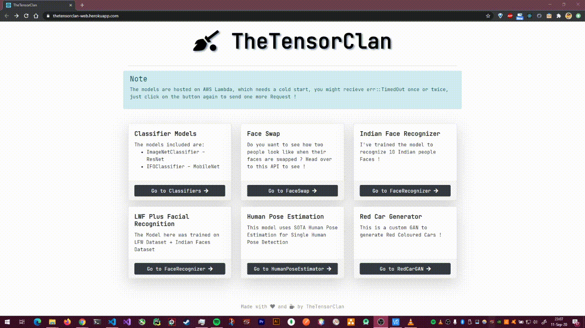
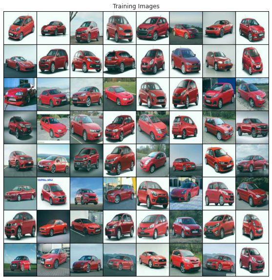
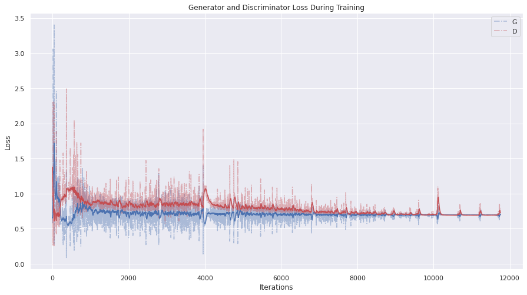
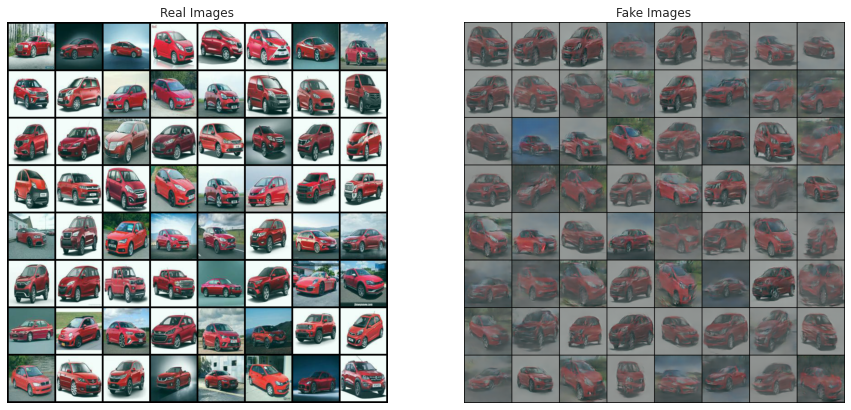
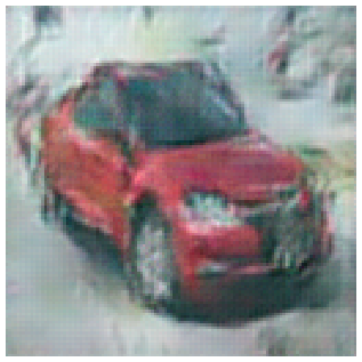

# 06 Generative Adversarial Networks

what a mouthful

## Assignment

-   Train any GAN to create 100x100 images of Indian Cars. (Links to an external site.)
-   KISS!
-   Move to Lambda and on your site.

## Solution

### Deployment: [https://thetensorclan-web.herokuapp.com/red-car-gan](https://thetensorclan-web.herokuapp.com/red-car-gan)

### Demo



### Notebooks

Dataset Creation: [https://github.com/satyajitghana/TSAI-DeepVision-EVA4.0-Phase-2/blob/master/06-GenerativeAdversarialNetworks/RedCarGAN_DatasetCreation.ipynb](https://github.com/satyajitghana/TSAI-DeepVision-EVA4.0-Phase-2/blob/master/06-GenerativeAdversarialNetworks/RedCarGAN_DatasetCreation.ipynb)

Training the GAN: [https://github.com/satyajitghana/TSAI-DeepVision-EVA4.0-Phase-2/blob/master/06-GenerativeAdversarialNetworks/RedCarGAN_Train_CustomNetwork.ipynb](https://github.com/satyajitghana/TSAI-DeepVision-EVA4.0-Phase-2/blob/master/06-GenerativeAdversarialNetworks/RedCarGAN_Train_CustomNetwork.ipynb)

## Dataset



The dataset was created from `~1400` images of red card, of all sorts, and facing all sorts of directions.

The images can be found here: [https://github.com/satyajitghana/TSAI-DeepVision-EVA4.0-Phase-2/tree/master/06-GenerativeAdversarialNetworks/car_images_100x100/red_cars](https://github.com/satyajitghana/TSAI-DeepVision-EVA4.0-Phase-2/tree/master/06-GenerativeAdversarialNetworks/car_images_100x100/red_cars)

## GAN Arch

### The Generator

```python
class Generator(nn.Module):
    """
    Creates the Generator

    nz (int): size of the latent z vector
    ngf (int): number of feature maps for the generator
    """
    def __init__(self, nz: int = 64, ngf: int = 64):
        super(Generator, self).__init__()

        self.main = nn.Sequential(
            # input is Z, going into a convolution
            nn.ConvTranspose2d( nz, ngf * 8, 4, 1, 0, bias=False),
            nn.BatchNorm2d(ngf * 8),
            nn.ReLU(True),
            # state size. (ngf*8) x 4 x 4
            nn.ConvTranspose2d( ngf * 8, ngf * 4, 4, 2, 1, bias=False),
            nn.BatchNorm2d(ngf * 4),
            nn.ReLU(True),
            # state size. (ngf*4) x 8 x 8
            nn.ConvTranspose2d( ngf * 4, ngf * 2, 4, 2, 1, bias=False),
            nn.BatchNorm2d(ngf * 2),
            nn.ReLU(True),
            # state size. (ngf*2) x 16 x 16
            nn.ConvTranspose2d( ngf * 2, ngf, 4, 2, 1, bias=False),
            nn.BatchNorm2d(ngf),
            nn.ReLU(True),
            # state size. (ngf) x 32 x 32
            nn.ConvTranspose2d( ngf, ngf, 4, 2, 1, bias=False),
            nn.BatchNorm2d(ngf),
            nn.ReLU(True),
            # state size. (ngf) x 64 x 64
            nn.ConvTranspose2d( ngf, nc, 4, 2, 1, bias=False),
            nn.Tanh()
            # state size. (nc) x 128 x 128
        )

    def forward(self, input):
        return self.main(input)
```

### The Discriminator

```python
class Discriminator(nn.Module):
    """
    Creates the Discriminator

    nc (int): number of channels of the input image
    ndf (int): number of feature maps for the discriminator

    This uses the special Spectral Normalization ref: https://arxiv.org/abs/1802.05957
    """
    def __init__(self, nc: int = 3, ndf: int = 64):
        super(Discriminator, self).__init__()

        self.main = nn.Sequential(
            # input is (nc) x 128 x 128
            torch.nn.utils.spectral_norm(nn.Conv2d(nc, ndf, 4, 2, 1, bias=False)),
            nn.LeakyReLU(0.2, inplace=True),
            # state size. (ndf) x 64 x 64
            torch.nn.utils.spectral_norm(nn.Conv2d(ndf, ndf * 2, 4, 2, 1, bias=False)),
            nn.LeakyReLU(0.2, inplace=True),
            # state size. (ndf*2) x 32 x 32
            torch.nn.utils.spectral_norm(nn.Conv2d(ndf * 2, ndf * 2, 4, 2, 1, bias=False)),
            nn.LeakyReLU(0.2, inplace=True),
            # state size. (ndf*2) x 16 x 16
            torch.nn.utils.spectral_norm(nn.Conv2d(ndf * 2, ndf * 4, 4, 2, 1, bias=False)),
            nn.LeakyReLU(0.2, inplace=True),
            # state size. (ndf*4) x 8 x 8
            torch.nn.utils.spectral_norm(nn.Conv2d(ndf * 4, ndf * 4, 4, 2, 1, bias=False)),
            nn.LeakyReLU(0.2, inplace=True),
            # state size. (ndf*8) x 4 x 4
            torch.nn.utils.spectral_norm(nn.Conv2d(ndf * 4, 1, 4, 1, 0, bias=False)),
            nn.Sigmoid()
        )

    def forward(self, input):
        return self.main(input)
```

Something to note here is that i've used `spectral_norm` instead of the normal batch_norm2d, why ? because read this paper [Spectral Normalization for Generative Adversarial Networks](https://arxiv.org/abs/1802.05957)

Training a GAN is difficult, ngl, everything matters here, the weight initialization is very important, as well as how we normalize the weights, the paper proves that spectral norm is the way to go to stabilize the training of the discriminator.

### Training Logs



As you can see that the generator and discriminator play around, trying to fight each other, but gradually they settle down, DO NOT let them, why ? because there will be a point when they both will mutually agree to generate white images and all you will get in the generator is white image, not good. so checkpoint every often so you have a history of the generator

Look at this beautiful montage


### Output Images




