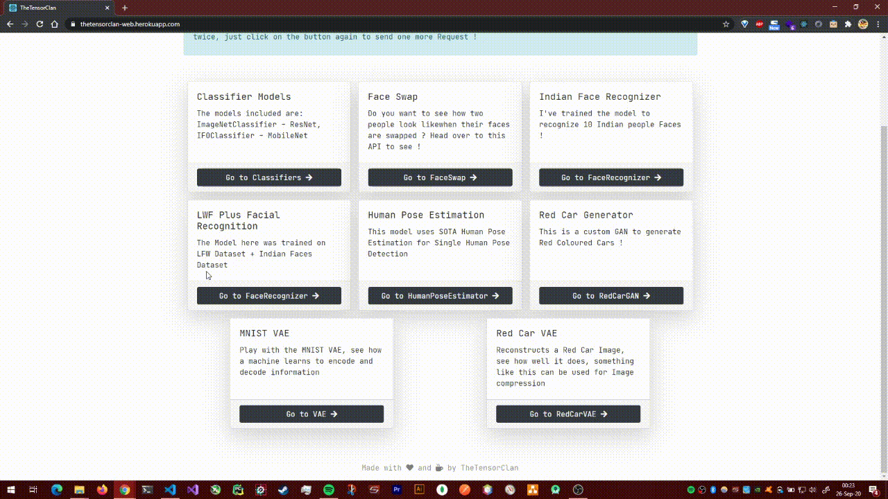
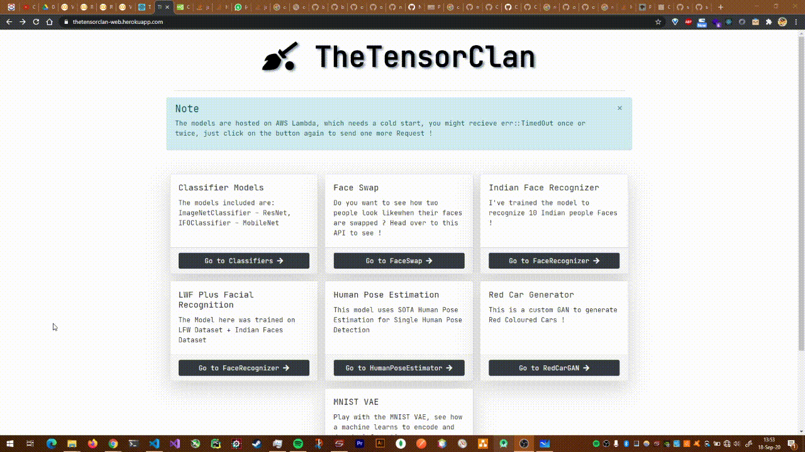

# 07 Variational AutoEncoders

## Assignment

Solve the last problem using VAEs.

## Solution

[https://githubtocolab.com/satyajitghana/TSAI-DeepVision-EVA4.0-Phase-2/blob/master/07-VariationalAutoEncoders/RedCar_VAE.ipynb](https://githubtocolab.com/satyajitghana/TSAI-DeepVision-EVA4.0-Phase-2/blob/master/07-VariationalAutoEncoders/RedCar_VAE.ipynb)

## URL [https://thetensorclan-web.herokuapp.com/red-car-vae](https://thetensorclan-web.herokuapp.com/red-car-vae)

## Demo

What's happening here you ask ?

So we are using a VAE model to encode and decode our image, what this does it, the encode encodes the image such that it has a smaller representation, and the task of the decoder is to decode this to the actual image, what you are seeing in this demo is that our backend server is doing both encoding and decoding and producing how the image would look, the latentz representation can be downloaded.

Imagine this scenario, you want to transfer a large image from one pc to another, and it costs a lot to transfer that huge file, in this case, the sender can have the encoder network and the receiver the decoder network, so the sender encodes the image, gets a smaller representation of the image, this small encode (latentz) is transferred over the network to the receiver, the receiver then uses the decoder network to decode the latentz to the actual image, this saves a lottt of data ! Online streaming platforms can benefit a lot from this. In this demo you can download the latentz file, the point is that this latentz file can product the original image with very less reconstruction loss.

The downside in my implementation is probably that my dataset was tooo diverse, with a lot of background details, i should have picked white backgound images, anyways i could also have increased the model capacity, but still i was pretty satisfied with this.

## MNIST VAE

As a fun, i tried to do the same with MNIST and the latentz vector is only 10 elements, so i let the user play with the values, and the reconstructed image can be modified as the latentz is modified in real time !!

But how did i do that ? hmmm ... i used ONNX.JS ! it was really great to understand how it worked, though a lot tiring. but it works !

Here's the link **[https://thetensorclan-web.herokuapp.com/mnist-vae](https://thetensorclan-web.herokuapp.com/mnist-vae)** It might take some time to load the model. one it does, simply draw something on the canvas !

Notebooks Associated - [https://github.com/satyajitghana/TSAI-DeepVision-EVA4.0-Phase-2/blob/master/07-VariationalAutoEncoders/VAE_MNIST_Experiments.ipynb](https://github.com/satyajitghana/TSAI-DeepVision-EVA4.0-Phase-2/blob/master/07-VariationalAutoEncoders/VAE_MNIST_Experiments.ipynb) - [https://github.com/satyajitghana/TSAI-DeepVision-EVA4.0-Phase-2/blob/master/07-VariationalAutoEncoders/VAE_MNIST_ONNXJS.ipynb](https://github.com/satyajitghana/TSAI-DeepVision-EVA4.0-Phase-2/blob/master/07-VariationalAutoEncoders/VAE_MNIST_ONNXJS.ipynb)

## Notes

-   A nice nifty trick i learnt, to open github jupyter notebooks in colab, simply replace the `github.com` with `githubtocolab.com` and that notebook will open in colab, neat eh ?
