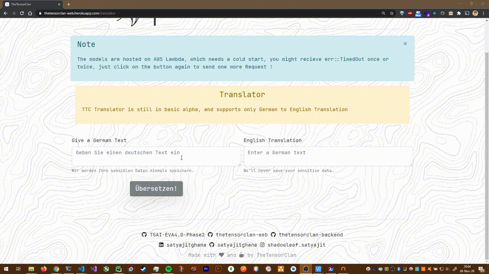

# 11 GRU, Attention and Transformers

## Assignment

- Look at this [file](https://bastings.github.io/annotated_encoder_decoder/)
- Re-implement this and move to lambda. Provide the option to provide German text and get English text back.

## Solution

Training: [https://github.com/satyajitghana/TSAI-DeepVision-EVA4.0-Phase-2/blob/master/11-Attention%26Transformers/GermanToEnglish.ipynb](https://github.com/satyajitghana/TSAI-DeepVision-EVA4.0-Phase-2/blob/master/11-Attention%26Transformers/GermanToEnglish.ipynb)

Inference: [https://github.com/satyajitghana/TSAI-DeepVision-EVA4.0-Phase-2/blob/master/11-Attention%26Transformers/de_to_en_inference.ipynb](https://github.com/satyajitghana/TSAI-DeepVision-EVA4.0-Phase-2/blob/master/11-Attention%26Transformers/de_to_en_inference.ipynb)

## Deployment: [https://thetensorclan-web.herokuapp.com/translator](https://thetensorclan-web.herokuapp.com/translator)

## Demo

