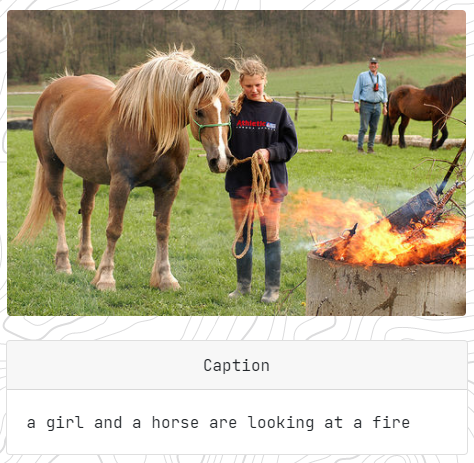
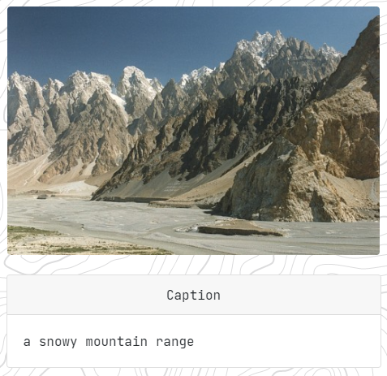
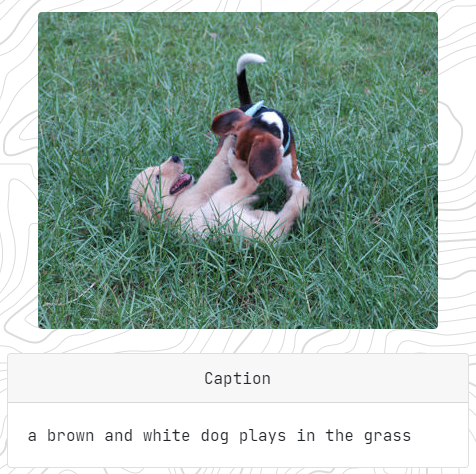

# 12 Image Captioning

## Assignment

- Go through this great [tutorial](https://github.com/sgrvinod/a-PyTorch-Tutorial-to-Image-Captioning) on Image Captioning. Train your own model and upload to Lambda.

## Solution

A lot of the code was taken from [a-PyTorch-Tutorial-to-Image-Captioning](https://github.com/sgrvinod/a-PyTorch-Tutorial-to-Image-Captioning) which was then forked and modified to support PyTorch 1.7.0, [https://github.com/satyajitghana/a-PyTorch-Tutorial-to-Image-Captioning](https://github.com/satyajitghana/a-PyTorch-Tutorial-to-Image-Captioning)

```text
BEST ACCURACY:

LOSS - 3.807, TOP-5 ACCURACY - 67.544, BLEU-4 - 0.14348413880451188
```

Dataset: [https://drive.google.com/file/d/1zc_Qqe4SMjFAOH59mt8zY7qW8AIYCUYq/view?usp=sharing](https://drive.google.com/file/d/1zc_Qqe4SMjFAOH59mt8zY7qW8AIYCUYq/view?usp=sharing)

Training: [https://github.com/satyajitghana/TSAI-DeepVision-EVA4.0-Phase-2/blob/master/12-ImageCaptioning/ImageCaptioning_Training.ipynb](https://github.com/satyajitghana/TSAI-DeepVision-EVA4.0-Phase-2/blob/master/12-ImageCaptioning/ImageCaptioning_Training.ipynb)

Inferencing: [https://github.com/satyajitghana/TSAI-DeepVision-EVA4.0-Phase-2/blob/master/12-ImageCaptioning/ImageCaptioning_Inferencing.ipynb](https://github.com/satyajitghana/TSAI-DeepVision-EVA4.0-Phase-2/blob/master/12-ImageCaptioning/ImageCaptioning_Inferencing.ipynb)

Models can be found here: [https://drive.google.com/drive/folders/15y4WyvaJI9AsfioKUNX1inJtrDqn2UvV?usp=sharing](https://drive.google.com/drive/folders/15y4WyvaJI9AsfioKUNX1inJtrDqn2UvV?usp=sharing)

- flickr8k_caption.encoder.scripted.pt
- flickr8k_caption.decoder.scripted.pt

## Examples







## Deployment: [https://thetensorclan-web.herokuapp.com/image-captioning](https://thetensorclan-web.herokuapp.com/image-captioning)

## Demo


