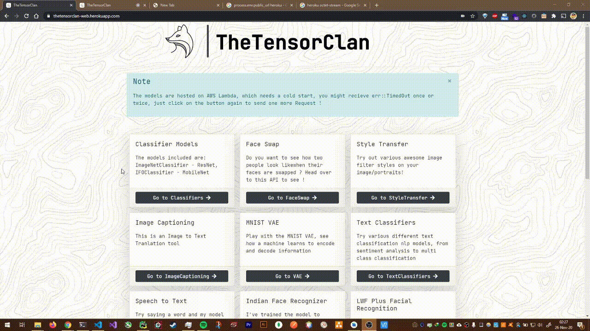
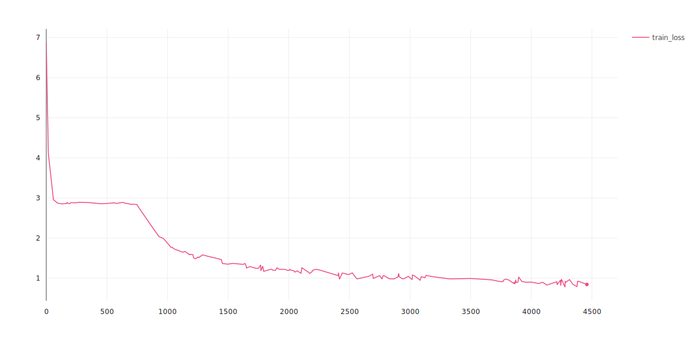
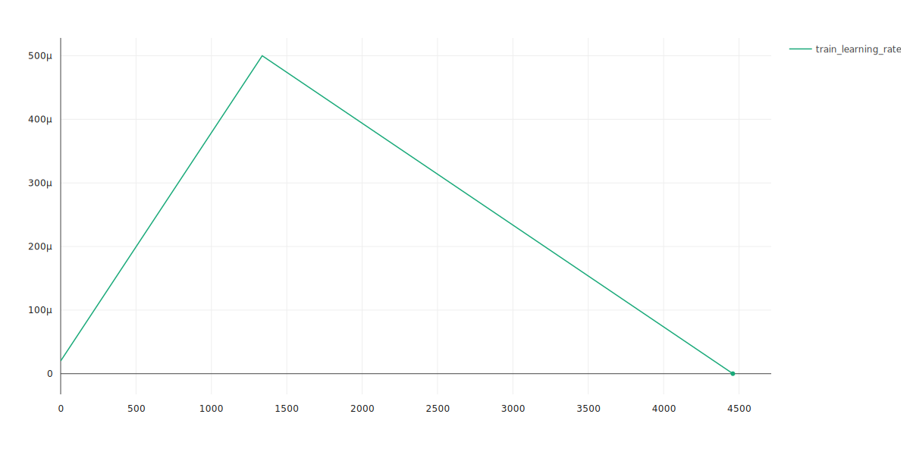
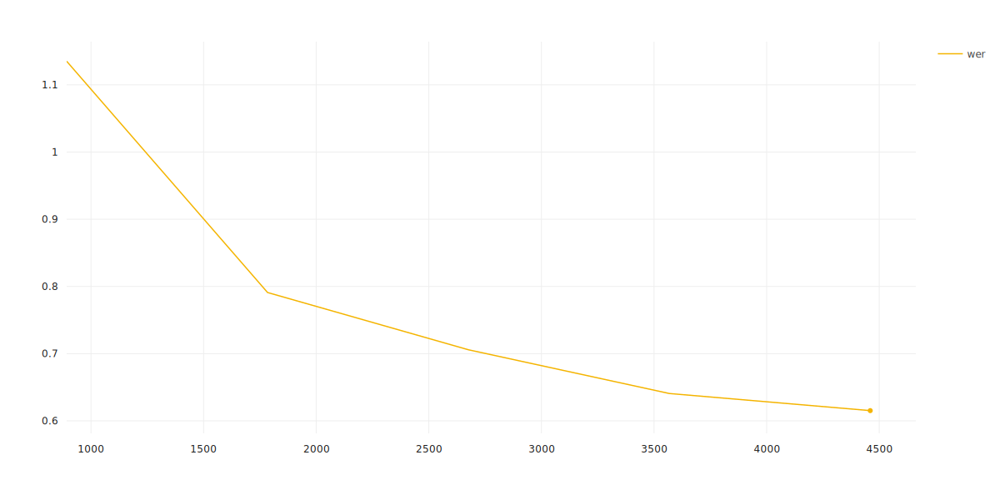
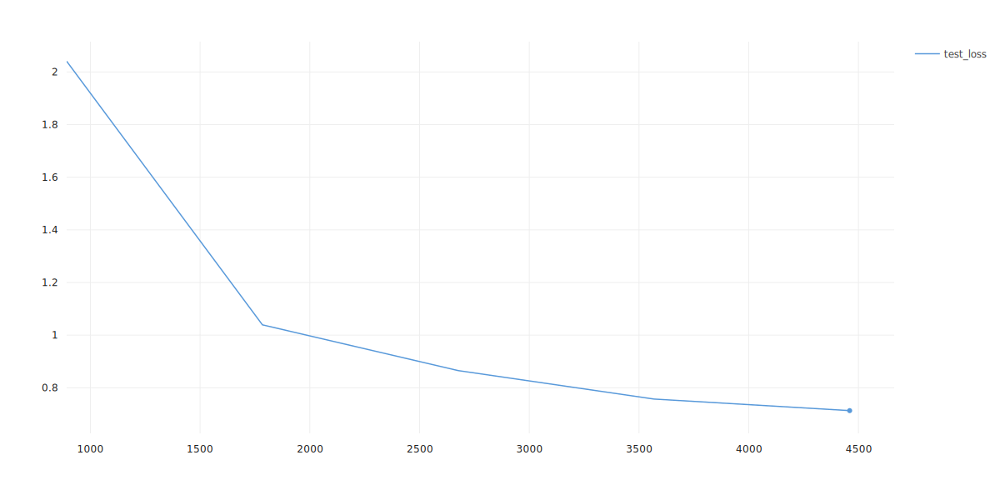

# 13 - AI for Sound

## Assignment

- Train both the models. Try to move the one you like to Lambda, and as usual, your submit your Lambda link.

- [COLAB](https://colab.research.google.com/drive/1z6Ia_zT9HbAd6zxpafDVzd1Q0klMGaA4?usp=sharing)
- [Build end to end speech recognition model](https://www.assemblyai.com/blog/end-to-end-speech-recognition-pytorch)

## Solution

## Dataset: [http://www.openslr.org/12/](http://www.openslr.org/12/)

## Comet ML Experiment: [go to experiment](https://www.comet.ml/satyajitghana/ttc-speechrecognition/094b8c46c22e4d34b1b157bb46cacee6)

Training Github: [https://github.com/satyajitghana/TSAI-DeepVision-EVA4.0-Phase-2/blob/master/13-AI4Sound/Speech_Recognition_Training.ipynb](https://github.com/satyajitghana/TSAI-DeepVision-EVA4.0-Phase-2/blob/master/13-AI4Sound/Speech_Recognition_Training.ipynb)

Training Colab: [https://colab.research.google.com/github/satyajitghana/TSAI-DeepVision-EVA4.0-Phase-2/blob/master/13-AI4Sound/Speech_Recognition_Training.ipynb](https://colab.research.google.com/github/satyajitghana/TSAI-DeepVision-EVA4.0-Phase-2/blob/master/13-AI4Sound/Speech_Recognition_Training.ipynb)

Inferencing Github: [https://github.com/satyajitghana/TSAI-DeepVision-EVA4.0-Phase-2/blob/master/13-AI4Sound/Speech_Recognition_Inferencing.ipynb](https://github.com/satyajitghana/TSAI-DeepVision-EVA4.0-Phase-2/blob/master/13-AI4Sound/Speech_Recognition_Inferencing.ipynb)

Inferencing Colab: [https://colab.research.google.com/github/satyajitghana/TSAI-DeepVision-EVA4.0-Phase-2/blob/master/13-AI4Sound/Speech_Recognition_Inferencing.ipynb](https://colab.research.google.com/github/satyajitghana/TSAI-DeepVision-EVA4.0-Phase-2/blob/master/13-AI4Sound/Speech_Recognition_Inferencing.ipynb)

## Deployment: [https://thetensorclan-web.herokuapp.com/speech-to-text](https://thetensorclan-web.herokuapp.com/speech-to-text)

So this deployment took a lot of work

- used soundfile to load the sound from the bytes recevied in flask
- react-media-recorder was used to record the audio as a WebM file and this was sent to the backend
- WebM cannot be used by soundfile, hence WebM was converted to Wav using ffmpeg
- soundfile needs additional installation which was done using Aptfile [https://github.com/heroku/heroku-buildpack-apt#aptfile](https://github.com/heroku/heroku-buildpack-apt#aptfile)
- ffmpeg is huge if you use sudo apt install, or add it in the Aptfile for heroku, so i used [https://github.com/jonathanong/heroku-buildpack-ffmpeg-latest](https://github.com/jonathanong/heroku-buildpack-ffmpeg-latest) which really reduced the total size, right now my total backend build, compressed is about 380MB which is pretty okay
- build packs are amazing !

## Demo



And Now the Boring Stuff ...

## Train Stats

```text
Num Model Parameters 23705373

Test set: Average loss: 0.7131, Average CER: 0.219417 Average WER: 0.6152
```

### Train Loss



### Train Learning Rate



### wer



### Test Loss



## The Model

```python
import torch.nn as nn

class CNNLayerNorm(nn.Module):
    """Layer normalization built for cnns input"""
    def __init__(self, n_feats):
        super(CNNLayerNorm, self).__init__()
        self.layer_norm = nn.LayerNorm(n_feats)

    def forward(self, x):
        # x (batch, channel, feature, time)
        x = x.transpose(2, 3).contiguous() # (batch, channel, time, feature)
        x = self.layer_norm(x)
        return x.transpose(2, 3).contiguous() # (batch, channel, feature, time) 


class ResidualCNN(nn.Module):
    """Residual CNN inspired by https://arxiv.org/pdf/1603.05027.pdf
        except with layer norm instead of batch norm
    """
    def __init__(self, in_channels, out_channels, kernel, stride, dropout, n_feats):
        super(ResidualCNN, self).__init__()

        self.cnn1 = nn.Conv2d(in_channels, out_channels, kernel, stride, padding=kernel//2)
        self.cnn2 = nn.Conv2d(out_channels, out_channels, kernel, stride, padding=kernel//2)
        self.dropout1 = nn.Dropout(dropout)
        self.dropout2 = nn.Dropout(dropout)
        self.layer_norm1 = CNNLayerNorm(n_feats)
        self.layer_norm2 = CNNLayerNorm(n_feats)

    def forward(self, x):
        residual = x  # (batch, channel, feature, time)
        x = self.layer_norm1(x)
        x = F.gelu(x)
        x = self.dropout1(x)
        x = self.cnn1(x)
        x = self.layer_norm2(x)
        x = F.gelu(x)
        x = self.dropout2(x)
        x = self.cnn2(x)
        x += residual
        return x # (batch, channel, feature, time)


class BidirectionalGRU(nn.Module):

    def __init__(self, rnn_dim, hidden_size, dropout, batch_first):
        super(BidirectionalGRU, self).__init__()

        self.BiGRU = nn.GRU(
            input_size=rnn_dim, hidden_size=hidden_size,
            num_layers=1, batch_first=batch_first, bidirectional=True)
        self.layer_norm = nn.LayerNorm(rnn_dim)
        self.dropout = nn.Dropout(dropout)

    def forward(self, x):
        x = self.layer_norm(x)
        x = F.gelu(x)
        x, _ = self.BiGRU(x)
        x = self.dropout(x)
        return x


class SpeechRecognitionModel(nn.Module):
    
    def __init__(self, n_cnn_layers, n_rnn_layers, rnn_dim, n_class, n_feats, stride=2, dropout=0.1):
        super(SpeechRecognitionModel, self).__init__()
        n_feats = n_feats//2
        self.cnn = nn.Conv2d(1, 32, 3, stride=stride, padding=3//2)  # cnn for extracting heirachal features

        # n residual cnn layers with filter size of 32
        self.rescnn_layers = nn.Sequential(*[
            ResidualCNN(32, 32, kernel=3, stride=1, dropout=dropout, n_feats=n_feats) 
            for _ in range(n_cnn_layers)
        ])
        self.fully_connected = nn.Linear(n_feats*32, rnn_dim)
        self.birnn_layers = nn.Sequential(*[
            BidirectionalGRU(rnn_dim=rnn_dim if i==0 else rnn_dim*2,
                             hidden_size=rnn_dim, dropout=dropout, batch_first=i==0)
            for i in range(n_rnn_layers)
        ])
        self.classifier = nn.Sequential(
            nn.Linear(rnn_dim*2, rnn_dim),  # birnn returns rnn_dim*2
            nn.GELU(),
            nn.Dropout(dropout),
            nn.Linear(rnn_dim, n_class)
        )

    def forward(self, x):
        x = self.cnn(x)
        x = self.rescnn_layers(x)
        sizes = x.size()
        x = x.view(sizes[0], sizes[1] * sizes[2], sizes[3])  # (batch, feature, time)
        x = x.transpose(1, 2) # (batch, time, feature)
        x = self.fully_connected(x)
        x = self.birnn_layers(x)
        x = self.classifier(x)
        return x

```
